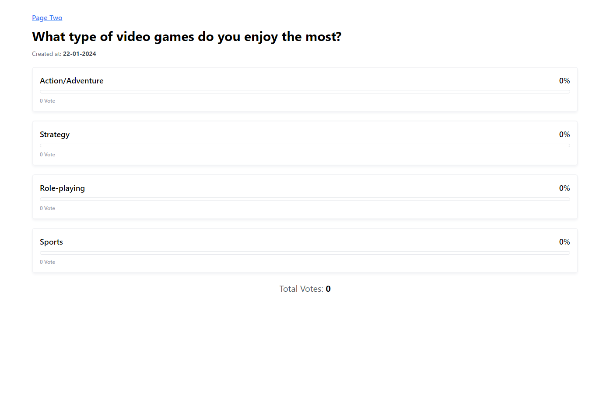
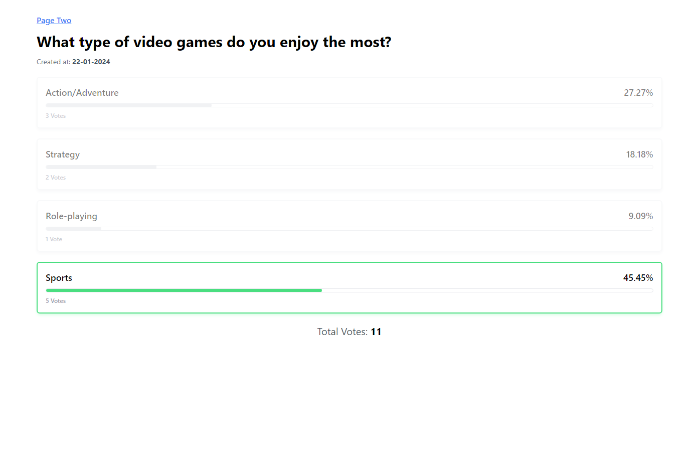
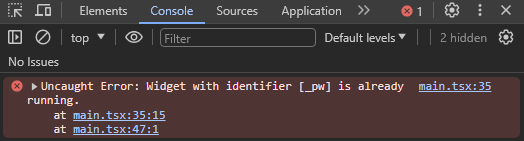
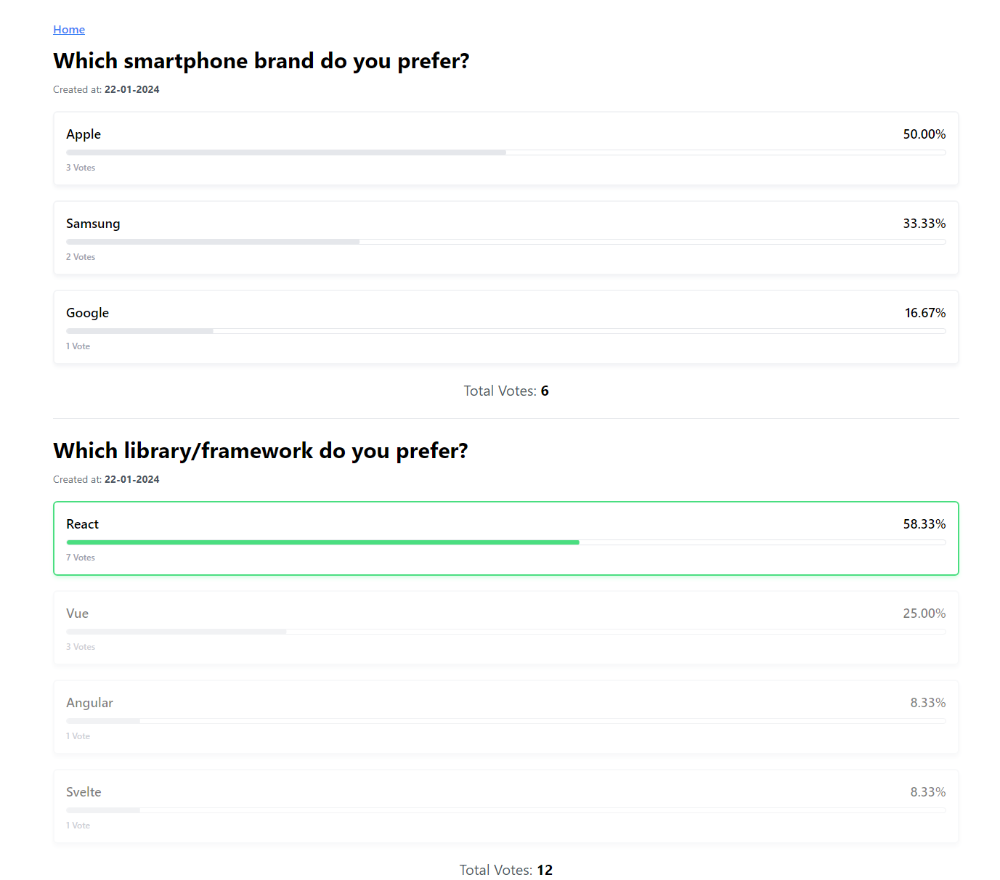
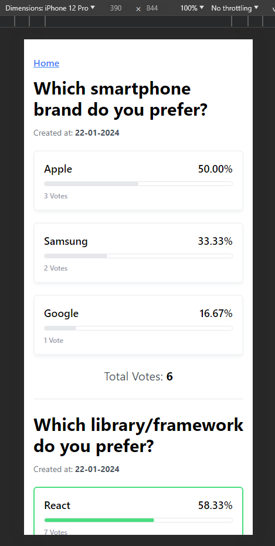

# Poll Widget

A simple poll widget that can be embedded without an iframe.
You can watch it live [here](https://pollwidget.netlify.app/).
<br />

## Installation

- **Install packages:** `npm i`
- **Run in development mode:** `npm run dev`
- **Open browser with URL:**  `http://localhost:5173/`

<br />

## Features
- Displays Poll based on the Configuration.
- Result is saved in the local-storage to keep vote count persistent.
- Can be reused in single/multiple html pages.
- Responsive.

<br />

## Technologies
- **UI Library:** React.ts
- **Bundler:** Vite
- **Styling:** Tailwind CSS

<br />

## Usage
- In `.html` file
```html
  <script>
    // Put this script block before end of the body tag.
    // #region: Widget Store setup
    // Below IIFE function can be considered as part of the sdk documentation where devs can simply copy the function like google analytics sdk.
    (function (uniqueId) {
      window.PollWidget = window.PollWidget || {};
      var PollWidget = window.PollWidget;
      PollWidget[uniqueId] = PollWidget[uniqueId] || function (config) {
        (PollWidget[uniqueId].c = PollWidget[uniqueId].c || []).push(config);
      };
    })("_pw"); // 👈 "_pw" is the unique identifier for the poll configuration (unique id is given by the user)
    // #endregion

    // #region: Attaching Configuration to the `window.PollWidget` object
    PollWidget._pw({
        parentElementId?: "id of the element inside which widget should be rendered. If not passed, container with unique id ('_pw' in this case) is created and is attached to the document.body",
        id: "config id",
        createdTimestamp: timestamp,
        question: "Question text",
        options: [
          {
            id: "Option id",
            label: "Option label",
            voteCount: 0,
          },
          ...
        ],
        totalVotes: 0, // total votes of this poll
      });
    // #endregion
  </script>
```
- In `main.tsx` file, config is taken from the `window.PollWidget` and it is:
  - Validated *(if the poll is not properly configured or same poll is configured twice, an Error is thrown)*,
  - Container for the Poll Widget is created based on the uniqueId mentioned by the user (example: `_pw`) while attaching config in the `window` object. *(if parentId is not passed)*,
  - Passed to the Widget component to render on the screen.

<br />

## Screenshots
- Poll Widget (First look)


<br />

- Poll Widget (After votes)


<br />

- Error when Same Poll is rendered twice


<br />

- Multiple Polls in the same page


<br />

- Mobile View
<br />

